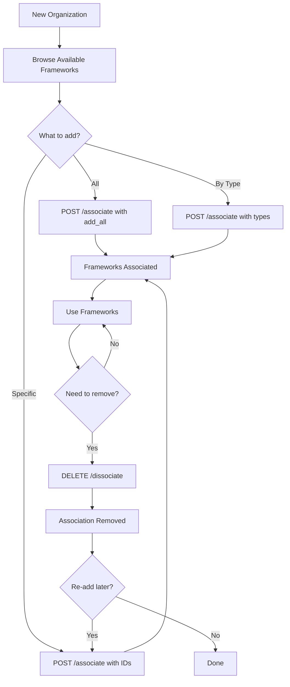

# Framework Association API Documentation

## 📋 Overview
New endpoints for managing framework associations with organizations. Organizations can now add/remove frameworks flexibly using multiple methods.

---

## 🆕 New Endpoints

### 1. **Associate Frameworks with Organization**
`POST /api/v1/frameworks/associate`

Add frameworks to your organization using three different methods.

#### **Authentication Required:** ✅ (Organization Admin)

#### **Request Body:**
```json
{
  "framework_ids": ["uuid1", "uuid2"],      // Optional: Specific framework IDs
  "framework_types": ["standard", "regulation"],  // Optional: Framework types
  "add_all": false                          // Optional: Add all frameworks
}
```

#### **Methods:**

##### **Method 1: Add by Specific IDs**
```json
{
  "framework_ids": [
    "1cb5d21f-6d33-4695-8dfe-af0363e5c960",
    "0d6106db-81b9-4fbc-b249-e961a8ac9526"
  ]
}
```

##### **Method 2: Add by Framework Types**
```json
{
  "framework_types": ["standard", "regulation"]
}
```

Available types:
- `standard` - Industry standards (ISO 27001, NIST CSF, etc.)
- `regulation` - Legal regulations (GDPR, HIPAA, CCPA, etc.)
- `guideline` - Guidelines and recommendations

##### **Method 3: Add All Frameworks**
```json
{
  "add_all": true
}
```

#### **Response:**
```json
{
  "success": true,
  "message": "Added 5 frameworks, skipped 2 already associated",
  "data": {
    "added_count": 5,
    "skipped_count": 2,
    "total_frameworks": 15,
    "added_frameworks": [
      {
        "id": "uuid",
        "name": "ISO 27001",
        "version": "2022",
        "framework_type": "standard",
        "category": "information_security",
        "region": "Global",
        "is_mandatory": false,
        "created_at": "2026-05-09T04:17:08.816983"
      }
    ]
  }
}
```

#### **cURL Examples:**

**Add specific frameworks:**
```bash
curl -X POST "http://localhost:8001/api/v1/frameworks/associate" \
  -H "Authorization: Bearer YOUR_TOKEN" \
  -H "Content-Type: application/json" \
  -d '{
    "framework_ids": ["1cb5d21f-6d33-4695-8dfe-af0363e5c960"]
  }'
```

**Add all standards:**
```bash
curl -X POST "http://localhost:8001/api/v1/frameworks/associate" \
  -H "Authorization: Bearer YOUR_TOKEN" \
  -H "Content-Type: application/json" \
  -d '{
    "framework_types": ["standard"]
  }'
```

**Add all regulations:**
```bash
curl -X POST "http://localhost:8001/api/v1/frameworks/associate" \
  -H "Authorization: Bearer YOUR_TOKEN" \
  -H "Content-Type: application/json" \
  -d '{
    "framework_types": ["regulation"]
  }'
```

**Add all frameworks:**
```bash
curl -X POST "http://localhost:8001/api/v1/frameworks/associate" \
  -H "Authorization: Bearer YOUR_TOKEN" \
  -H "Content-Type: application/json" \
  -d '{
    "add_all": true
  }'
```

---

### 2. **Get All Available Frameworks**
`GET /api/v1/frameworks/available/all`

Get ALL frameworks in the system (not just your organization's frameworks).

#### **Authentication Required:** ✅

#### **Query Parameters:**
- `skip` (int, default: 0) - Pagination offset
- `limit` (int, default: 100, max: 200) - Number of results
- `framework_type` (string, optional) - Filter by type
- `category` (string, optional) - Filter by category
- `search` (string, optional) - Search in name/description

#### **Response:**
```json
{
  "success": true,
  "message": "Retrieved 22 available frameworks",
  "data": {
    "frameworks": [
      {
        "id": "uuid",
        "name": "ISO 27001",
        "version": "2022",
        "framework_type": "standard",
        "category": "information_security",
        "region": "Global",
        "is_mandatory": false,
        "created_at": "2026-05-09T04:17:08.816983",
        "is_associated": true    // ← Shows if already associated
      }
    ],
    "total": 22,
    "skip": 0,
    "limit": 100,
    "organization_associated_count": 15
  }
}
```

#### **Key Feature:**
- `is_associated` field shows if the framework is already associated with your organization
- Useful for discovering new frameworks to add

#### **cURL Examples:**

**Get all available frameworks:**
```bash
curl -X GET "http://localhost:8001/api/v1/frameworks/available/all" \
  -H "Authorization: Bearer YOUR_TOKEN"
```

**Get available standards only:**
```bash
curl -X GET "http://localhost:8001/api/v1/frameworks/available/all?framework_type=standard" \
  -H "Authorization: Bearer YOUR_TOKEN"
```

**Search for GDPR:**
```bash
curl -X GET "http://localhost:8001/api/v1/frameworks/available/all?search=GDPR" \
  -H "Authorization: Bearer YOUR_TOKEN"
```

---

### 3. **Remove Framework from Organization**
`DELETE /api/v1/frameworks/dissociate/{framework_id}`

Remove a framework association from your organization.

#### **Authentication Required:** ✅ (Organization Admin)

#### **Important Notes:**
- ⚠️ This only removes the **association**, NOT the framework itself
- The framework still exists in the system
- Can be re-associated later
- Does NOT delete framework data or controls

#### **Response:**
```json
{
  "success": true,
  "message": "Framework 'GDPR' removed from organization",
  "data": null
}
```

#### **cURL Example:**
```bash
curl -X DELETE "http://localhost:8001/api/v1/frameworks/dissociate/8ec5599b-c826-45eb-8ca4-cd4eb47b9539" \
  -H "Authorization: Bearer YOUR_TOKEN"
```

---

## 🎯 Use Cases

### Use Case 1: New Organization Setup
**Scenario:** New organization wants to add all compliance frameworks

```bash
# Step 1: Add all frameworks
curl -X POST "http://localhost:8001/api/v1/frameworks/associate" \
  -H "Authorization: Bearer $TOKEN" \
  -H "Content-Type: application/json" \
  -d '{"add_all": true}'

# Result: All 22+ frameworks added to organization
```

### Use Case 2: Add Only Regulations
**Scenario:** Organization only needs regulatory compliance frameworks

```bash
# Add all regulations (GDPR, HIPAA, CCPA, etc.)
curl -X POST "http://localhost:8001/api/v1/frameworks/associate" \
  -H "Authorization: Bearer $TOKEN" \
  -H "Content-Type: application/json" \
  -d '{"framework_types": ["regulation"]}'
```

### Use Case 3: Selective Framework Addition
**Scenario:** Organization wants specific frameworks only

```bash
# Step 1: Browse available frameworks
curl -X GET "http://localhost:8001/api/v1/frameworks/available/all" \
  -H "Authorization: Bearer $TOKEN"

# Step 2: Add specific ones
curl -X POST "http://localhost:8001/api/v1/frameworks/associate" \
  -H "Authorization: Bearer $TOKEN" \
  -H "Content-Type: application/json" \
  -d '{
    "framework_ids": [
      "1cb5d21f-6d33-4695-8dfe-af0363e5c960",  // ISO 27001
      "8ec5599b-c826-45eb-8ca4-cd4eb47b9539"   // CCPA
    ]
  }'
```

### Use Case 4: Remove Unused Framework
**Scenario:** Organization no longer needs a specific framework

```bash
# Remove CCPA from organization
curl -X DELETE "http://localhost:8001/api/v1/frameworks/dissociate/8ec5599b-c826-45eb-8ca4-cd4eb47b9539" \
  -H "Authorization: Bearer $TOKEN"
```

---

## 📊 Comparison: Old vs New

### Before (Old Way)
```bash
# Had to create each framework individually
POST /api/v1/frameworks/
{
  "name": "ISO 27001",
  "framework_type": "standard",
  ...
}
# Repeat 22 times! 😫
```

### After (New Way)
```bash
# Add all frameworks at once
POST /api/v1/frameworks/associate
{
  "add_all": true
}
# Done! ✅
```

---

## 🔐 Permissions

| Endpoint | Required Role | Notes |
|----------|--------------|-------|
| `POST /associate` | Organization Admin | Can add frameworks |
| `GET /available/all` | Any authenticated user | Read-only |
| `DELETE /dissociate/{id}` | Organization Admin | Can remove associations |

---

## ✅ Testing Results

### Test 1: Add by Type ✅
```bash
Request:  {"framework_types": ["regulation"]}
Response: Added 0, Skipped 13 (already associated)
Status:   ✅ Working
```

### Test 2: Remove Association ✅
```bash
Request:  DELETE /dissociate/8ec5599b-c826-45eb-8ca4-cd4eb47b9539
Response: "Framework 'CCPA' removed from organization"
Status:   ✅ Working
```

### Test 3: Add by ID ✅
```bash
Request:  {"framework_ids": ["8ec5599b-c826-45eb-8ca4-cd4eb47b9539"]}
Response: Added 1, Skipped 0
Status:   ✅ Working
```

### Test 4: Add All ✅
```bash
Request:  {"add_all": true}
Response: Added 0, Skipped 22 (all already associated)
Status:   ✅ Working
```

### Test 5: Available Frameworks ✅
```bash
Request:  GET /available/all?limit=5
Response: 5 frameworks with is_associated flag
Status:   ✅ Working
```

---

## 🎨 Swagger UI

All endpoints are available in Swagger UI:
- **URL:** http://localhost:8001/docs
- **Section:** Frameworks
- **New Endpoints:**
  - `POST /api/v1/frameworks/associate`
  - `GET /api/v1/frameworks/available/all`
  - `DELETE /api/v1/frameworks/dissociate/{framework_id}`

---

## 📝 Request/Response Schemas

### AddFrameworksRequest
```typescript
{
  framework_ids?: string[];        // Optional: List of UUIDs
  framework_types?: string[];      // Optional: ["standard", "regulation", "guideline"]
  add_all?: boolean;               // Optional: true/false
}
```

### AddFrameworksResponse
```typescript
{
  added_count: number;             // Number of frameworks added
  skipped_count: number;           // Number already associated
  total_frameworks: number;        // Total after operation
  added_frameworks: Framework[];   // List of newly added frameworks
}
```

---

## 🚀 Benefits

### 1. **Flexibility**
- Add frameworks in bulk or individually
- Filter by type for targeted additions
- Add all frameworks with one click

### 2. **Efficiency**
- No need to create frameworks manually
- Batch operations save time
- Smart duplicate detection (skips already associated)

### 3. **Discovery**
- Browse all available frameworks
- See which ones are already associated
- Easy to find and add new frameworks

### 4. **Safety**
- Dissociate doesn't delete the framework
- Can re-associate anytime
- No data loss

---

## 🔄 Workflow Example



---

## 📚 Related Documentation

- [Many-to-Many Migration Guide](./MANY_TO_MANY_MIGRATION_COMPLETE.md)
- [Frameworks API Complete Guide](./FRAMEWORKS_API_SUMMARY.md)
- [Swagger Documentation](http://localhost:8001/docs)

---

**Created:** May 9, 2026  
**Version:** 1.0.0  
**Status:** ✅ Production Ready
