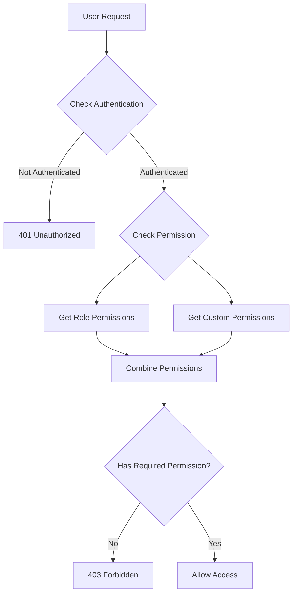

# نظام الصلاحيات المتقدم - Role-Based Permissions System

## 📋 نظرة عامة / Overview

تم إنشاء نظام صلاحيات متقدم يسمح بالتحكم الدقيق في ما يمكن لكل مستخدم القيام به في النظام.

A comprehensive role-based permission system has been created that allows fine-grained control over what each user can do in the system.

---

## 🎯 المتطلبات المنفذة / Implemented Requirements

### **Org Admin Permissions (15 صلاحية)**
✅ بدء Assessment  
✅ عرض كل الـ sessions/chats لكل الـ members  
✅ اختيار الـ framework  
✅ عرض score لكل member  
✅ عرض total score للـ organization  
✅ عرض Dashboard (assets, vulnerabilities, environment)  
✅ منح permissions للـ members لعرض الـ dashboard  
✅ إدارة الـ members  
✅ إدارة الـ frameworks  

### **Org Member Permissions (2 صلاحية + إضافية)**
✅ عرض الـ chat/session الخاص بيه فقط  
✅ عرض الـ score الخاص بيه فقط  
✅ عرض Dashboard (إذا تم منحه الإذن من الـ admin)  

---

## 🗄️ Database Schema

### **Table: `user_role_permissions`**

```sql
CREATE TABLE user_role_permissions (
    id UUID PRIMARY KEY DEFAULT gen_random_uuid(),
    user_id UUID NOT NULL REFERENCES users(id) ON DELETE CASCADE,
    permissions TEXT[] NOT NULL,  -- Array of permission strings
    granted_by_id UUID REFERENCES users(id) ON DELETE SET NULL,
    granted_at TIMESTAMP DEFAULT NOW(),
    expires_at TIMESTAMP NULL,  -- Optional expiry
    is_active BOOLEAN DEFAULT TRUE,
    notes VARCHAR(500),  -- Why permission was granted
    created_at TIMESTAMP DEFAULT NOW(),
    updated_at TIMESTAMP DEFAULT NOW()
);

CREATE INDEX ix_user_role_permissions_user_id ON user_role_permissions(user_id);
```

---

## 🔐 Permission Categories

### **1. Assessment Permissions (6)**
| Permission | Value | Description | Admin | Member |
|-----------|-------|-------------|-------|--------|
| Start Assessment | `start_assessment` | Can initiate new assessments | ✅ | ❌ |
| View Own Sessions | `view_own_sessions` | Can view own sessions/chats | ✅ | ✅ |
| View All Sessions | `view_all_sessions` | Can view all members' sessions | ✅ | ❌ |
| View Own Score | `view_own_score` | Can view own compliance score | ✅ | ✅ |
| View All Scores | `view_all_scores` | Can view all members' scores | ✅ | ❌ |
| View Org Total Score | `view_org_total_score` | Can view organization total score | ✅ | ❌ |

### **2. Framework Permissions (2)**
| Permission | Value | Description | Admin | Member |
|-----------|-------|-------------|-------|--------|
| Select Framework | `select_framework` | Can select frameworks for assessments | ✅ | ❌ |
| Manage Frameworks | `manage_frameworks` | Can add/update/remove frameworks | ✅ | ❌ |

### **3. Dashboard Permissions (4)**
| Permission | Value | Description | Admin | Member |
|-----------|-------|-------------|-------|--------|
| View Dashboard | `view_dashboard` | Can access compliance dashboard | ✅ | 🔓* |
| View Assets | `view_assets` | Can view organization assets | ✅ | 🔓* |
| View Vulnerabilities | `view_vulnerabilities` | Can view security vulnerabilities | ✅ | 🔓* |
| Manage Dashboard Access | `manage_dashboard_access` | Can grant dashboard access to members | ✅ | ❌ |

*🔓 = Can be granted by admin

### **4. Member Management Permissions (3)**
| Permission | Value | Description | Admin | Member |
|-----------|-------|-------------|-------|--------|
| View Members | `view_members` | Can view organization members | ✅ | ❌ |
| Manage Members | `manage_members` | Can add/update/remove members | ✅ | ❌ |
| Grant Permissions | `grant_permissions` | Can grant permissions to users | ✅ | ❌ |

---

## 🔌 API Endpoints

### **Base URL:** `/api/v1/permissions`

### **1. Get My Permissions**
```http
GET /api/v1/permissions/me
Authorization: Bearer {token}
```

**Response:**
```json
{
  "success": true,
  "message": "Permissions retrieved successfully",
  "data": {
    "user_id": "uuid",
    "role": "org_admin",
    "role_permissions": [
      "start_assessment",
      "view_own_sessions",
      "view_all_sessions",
      ...
    ],
    "custom_permissions": [],
    "all_permissions": [...]
  }
}
```

---

### **2. Get Permissions Catalog**
```http
GET /api/v1/permissions/catalog
Authorization: Bearer {token}
```

**Response:**
```json
{
  "success": true,
  "data": {
    "permissions": [
      {
        "value": "start_assessment",
        "label": "Start Assessment",
        "description": "Can initiate new compliance assessments",
        "category": "Assessment"
      },
      ...
    ],
    "by_category": {
      "Assessment": [...],
      "Framework": [...],
      "Dashboard": [...],
      "Members": [...]
    },
    "total": 15
  }
}
```

---

### **3. Get Role Permissions**
```http
GET /api/v1/permissions/roles
Authorization: Bearer {token}
```

**Response:**
```json
{
  "success": true,
  "data": {
    "roles": {
      "org_admin": {
        "role": "org_admin",
        "permissions": ["start_assessment", ...],
        "count": 15
      },
      "org_member": {
        "role": "org_member",
        "permissions": ["view_own_sessions", "view_own_score"],
        "count": 2
      }
    }
  }
}
```

---

### **4. Get User Permissions (Admin Only)**
```http
GET /api/v1/permissions/user/{user_id}
Authorization: Bearer {token}
```

**Requires:** `view_members` permission

**Response:**
```json
{
  "success": true,
  "data": {
    "user_id": "uuid",
    "user_email": "user@example.com",
    "user_name": "John Doe",
    "role": "org_member",
    "role_permissions": ["view_own_sessions", "view_own_score"],
    "custom_permissions": ["view_dashboard"],
    "all_permissions": ["view_own_sessions", "view_own_score", "view_dashboard"]
  }
}
```

---

### **5. Grant Permissions (Admin Only)**
```http
POST /api/v1/permissions/grant
Authorization: Bearer {token}
Content-Type: application/json
```

**Requires:** `grant_permissions` permission

**Request Body:**
```json
{
  "user_id": "uuid",
  "permissions": ["view_dashboard", "view_assets"],
  "notes": "Granted for project work",
  "expires_at": "2026-12-31T23:59:59"  // Optional
}
```

**Response:**
```json
{
  "success": true,
  "message": "Granted 2 permissions to user",
  "data": {
    "user_id": "uuid",
    "granted_permissions": ["view_dashboard", "view_assets"],
    "total_custom_permissions": 2
  }
}
```

---

### **6. Revoke Permissions (Admin Only)**
```http
POST /api/v1/permissions/revoke
Authorization: Bearer {token}
Content-Type: application/json
```

**Requires:** `grant_permissions` permission

**Request Body:**
```json
{
  "user_id": "uuid",
  "permissions": ["view_dashboard"]
}
```

**Response:**
```json
{
  "success": true,
  "message": "Revoked 1 permissions from user",
  "data": {
    "user_id": "uuid",
    "revoked_permissions": ["view_dashboard"],
    "remaining_custom_permissions": 1
  }
}
```

---

### **7. Revoke All Custom Permissions (Admin Only)**
```http
DELETE /api/v1/permissions/user/{user_id}/all
Authorization: Bearer {token}
```

**Requires:** `grant_permissions` permission

**Response:**
```json
{
  "success": true,
  "message": "All custom permissions revoked from user",
  "data": {
    "user_id": "uuid",
    "user_email": "user@example.com"
  }
}
```

---

### **8. Check Permission**
```http
GET /api/v1/permissions/check/{permission}
Authorization: Bearer {token}
```

**Example:** `/api/v1/permissions/check/view_dashboard`

**Response:**
```json
{
  "success": true,
  "message": "Permission check completed",
  "data": {
    "permission": "view_dashboard",
    "has_permission": true,
    "source": "custom"  // or "role"
  }
}
```

---

## 💻 Usage in Code

### **1. Require Single Permission**
```python
from app.auth.permissions import require_permission
from app.models.enums import Permission

@router.get("/dashboard")
async def get_dashboard(
    current_user = Depends(require_permission(Permission.VIEW_DASHBOARD))
):
    # Only users with VIEW_DASHBOARD permission can access
    return {"dashboard": "data"}
```

### **2. Require Any Permission**
```python
from app.auth.permissions import require_any_permission

@router.get("/sessions")
async def get_sessions(
    current_user = Depends(require_any_permission(
        Permission.VIEW_OWN_SESSIONS,
        Permission.VIEW_ALL_SESSIONS
    ))
):
    # User needs at least one of these permissions
    return {"sessions": []}
```

### **3. Require All Permissions**
```python
from app.auth.permissions import require_all_permissions

@router.post("/sensitive-action")
async def sensitive_action(
    current_user = Depends(require_all_permissions(
        Permission.MANAGE_MEMBERS,
        Permission.GRANT_PERMISSIONS
    ))
):
    # User needs ALL these permissions
    return {"status": "success"}
```

### **4. Check Permission Programmatically**
```python
from app.auth.permissions import check_user_permission

async def my_function(user, db):
    has_perm = await check_user_permission(
        user,
        Permission.VIEW_DASHBOARD,
        db
    )
    
    if has_perm:
        # Do something
        pass
```

---

## 🎯 Use Cases / حالات الاستخدام

### **Use Case 1: Grant Dashboard Access to Member**
**Scenario:** Admin wants to give a member access to view the dashboard

```bash
curl -X POST "http://localhost:8001/api/v1/permissions/grant" \
  -H "Authorization: Bearer ADMIN_TOKEN" \
  -H "Content-Type: application/json" \
  -d '{
    "user_id": "member-uuid",
    "permissions": ["view_dashboard", "view_assets", "view_vulnerabilities"],
    "notes": "Granted for security audit project"
  }'
```

**Result:** Member can now access dashboard

---

### **Use Case 2: Temporary Elevated Access**
**Scenario:** Grant temporary permissions that expire

```bash
curl -X POST "http://localhost:8001/api/v1/permissions/grant" \
  -H "Authorization: Bearer ADMIN_TOKEN" \
  -H "Content-Type: application/json" \
  -d '{
    "user_id": "member-uuid",
    "permissions": ["view_all_sessions", "view_all_scores"],
    "notes": "Temporary access for compliance review",
    "expires_at": "2026-06-30T23:59:59"
  }'
```

**Result:** Member has elevated access until June 30, 2026

---

### **Use Case 3: Revoke Dashboard Access**
**Scenario:** Remove dashboard access from a member

```bash
curl -X POST "http://localhost:8001/api/v1/permissions/revoke" \
  -H "Authorization: Bearer ADMIN_TOKEN" \
  -H "Content-Type: application/json" \
  -d '{
    "user_id": "member-uuid",
    "permissions": ["view_dashboard", "view_assets"]
  }'
```

**Result:** Member can no longer access dashboard

---

### **Use Case 4: Check User Permissions**
**Scenario:** Admin wants to see what permissions a user has

```bash
curl -X GET "http://localhost:8001/api/v1/permissions/user/member-uuid" \
  -H "Authorization: Bearer ADMIN_TOKEN"
```

**Result:** Shows all permissions (role + custom)

---

## 🔄 Permission Flow



---

## 📊 Permission Matrix

| Action | Org Admin | Org Member | Can Be Granted |
|--------|-----------|------------|----------------|
| Start Assessment | ✅ | ❌ | ❌ |
| View Own Sessions | ✅ | ✅ | N/A |
| View All Sessions | ✅ | ❌ | ❌ |
| View Own Score | ✅ | ✅ | N/A |
| View All Scores | ✅ | ❌ | ❌ |
| View Org Total Score | ✅ | ❌ | ❌ |
| Select Framework | ✅ | ❌ | ❌ |
| Manage Frameworks | ✅ | ❌ | ❌ |
| View Dashboard | ✅ | ❌ | ✅ |
| View Assets | ✅ | ❌ | ✅ |
| View Vulnerabilities | ✅ | ❌ | ✅ |
| Manage Dashboard Access | ✅ | ❌ | ❌ |
| View Members | ✅ | ❌ | ❌ |
| Manage Members | ✅ | ❌ | ❌ |
| Grant Permissions | ✅ | ❌ | ❌ |

---

## 🧪 Testing

### **Test 1: Get My Permissions**
```bash
TOKEN="your-token"
curl -X GET "http://localhost:8001/api/v1/permissions/me" \
  -H "Authorization: Bearer $TOKEN"
```

**Expected:** List of all your permissions

### **Test 2: Grant Dashboard Access**
```bash
curl -X POST "http://localhost:8001/api/v1/permissions/grant" \
  -H "Authorization: Bearer $ADMIN_TOKEN" \
  -H "Content-Type: application/json" \
  -d '{
    "user_id": "member-uuid",
    "permissions": ["view_dashboard"]
  }'
```

**Expected:** Success message with granted permissions

### **Test 3: Check Permission**
```bash
curl -X GET "http://localhost:8001/api/v1/permissions/check/view_dashboard" \
  -H "Authorization: Bearer $TOKEN"
```

**Expected:** `has_permission: true/false`

---

## 📁 Files Created/Modified

### **New Files:**
1. `backend/app/models/permissions.py` - Permission model and logic
2. `backend/app/schemas/permissions.py` - Permission schemas
3. `backend/app/auth/permissions.py` - Permission checking utilities
4. `backend/app/api/v1/permissions.py` - Permissions API endpoints
5. `backend/alembic/versions/5cbae36f3596_*.py` - Migration file

### **Modified Files:**
1. `backend/app/models/enums.py` - Added Permission enum
2. `backend/app/models/identity.py` - Added custom_permissions relationship
3. `backend/app/api/v1/router.py` - Added permissions router

---

## 🎉 Summary / الملخص

### **✅ What Was Implemented:**
- ✅ User role permissions table
- ✅ 15 permissions across 4 categories
- ✅ Role-based default permissions
- ✅ Custom user permissions
- ✅ 8 API endpoints for permission management
- ✅ Permission checking utilities
- ✅ Admin can grant/revoke permissions
- ✅ Members can be granted dashboard access
- ✅ All requirements met

### **📊 Statistics:**
- **Permissions:** 15 total
- **Roles:** 2 (org_admin, org_member)
- **API Endpoints:** 8
- **Categories:** 4 (Assessment, Framework, Dashboard, Members)
- **Database Tables:** 1 new table
- **Lines of Code:** ~1000+ lines

### **🚀 Production Ready:**
- ✅ Database migration applied
- ✅ All endpoints working
- ✅ Swagger documentation available
- ✅ Permission checking working
- ✅ Role-based access control functional

---

**Created:** May 9, 2026  
**Version:** 1.0.0  
**Status:** ✅ Complete & Production Ready  
**Database:** Supabase PostgreSQL  
**Swagger:** http://localhost:8001/docs
